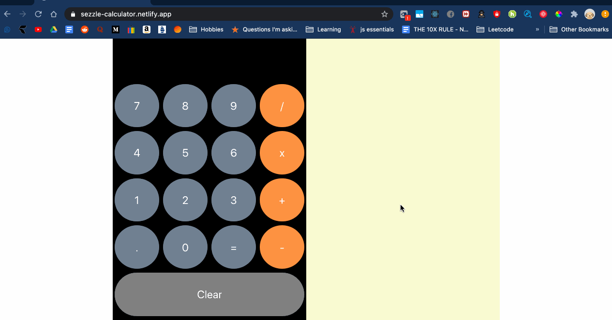

# Sezzle Calculator App - Front End Server

This application implements a real-time calculator app that allows users to access
a calculator and produce calculations. When results are produced, they are stored 
and shown top 10 most recent calculations performed.

When multiple users perform calculations, recently logged calculations will be available
for everyone between different browsers and tabs.

### Calculator App: https://sezzle-calculator.netlify.app/

### Technologies Used
- **React:** Modular, Reusable Front end components 
- **React Hooks:** Management of React state
- **MySQL:** SQL based database to store recent calculations made on the application
- **Node/Express:** Backend server that connects with MySQL database to store recent calculator calculations and connect with the client to backend restful api routes
- **Sass:** Refactor CSS stylesheets
- **Heroku / Netlify** for Deployment

### Challenges
I initially spent a lot of time figuring out updating the recent calculations table in real-time exploring different technologies such as web sockets, storing data into localStorage and sessionStorage, or using Redux to sync states however that would require me to use learn additional things for the assignment. I am however interested in learning Redux. But due to the time constraints of the assignment, I want to meet the requirements of the application.

In addition, I also did face a lot of troubles regarding deploying the application. I was exploring how to use both Netlify and Heroku and decided to deploy the React front end on Netlify and my DB/REST API on Heroku. 

### Quick Demo

### How to Run Locally
Assuming you have a local MySQL database to use to store recent calculations data, you can run this application locally.
1. Install client dependencies
`npm install`

2. To run react front end client:
`npm run start`

3. Go to localhost:3000 to access client!

### Backend Repo
The implementation of my DB/REST API can be found here:
https://github.com/breindy/sezzle-calc-backend